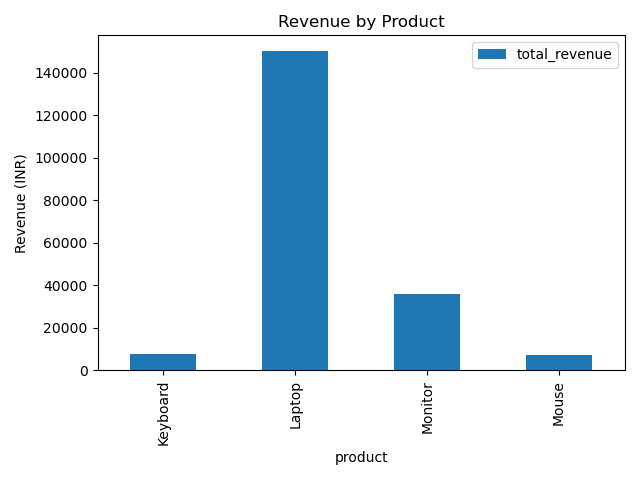

# Task 7 - Sales Summary Using SQLite and Python

This project connects to a local SQLite database, runs SQL queries to get product-wise sales and revenue data, and visualizes it using a bar chart.

## Tools Used:
- Python
- SQLite
- pandas
- matplotlib

## Steps:
1. Created a SQLite database (`sales_data.db`) and inserted sample data.
2. Ran SQL queries to get total quantity and total revenue per product.
3. Loaded the SQL result into a pandas DataFrame.
4. Printed the result and visualized it using a bar chart.
5. Saved the chart as `sales_chart.png`.

## Output:

## Author:
[Mummadi Ramcharan]
